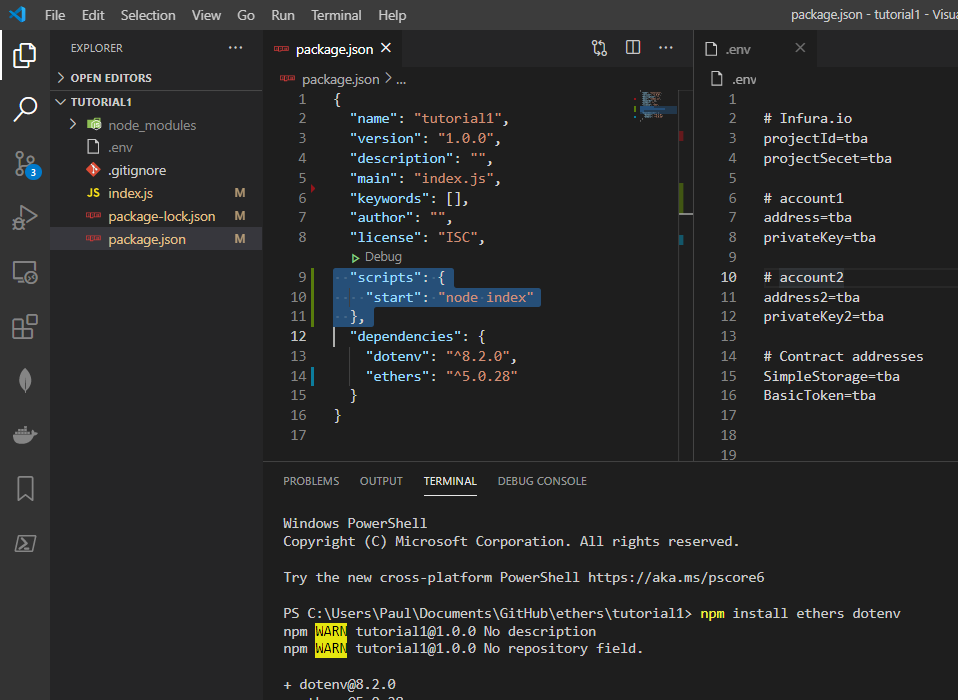
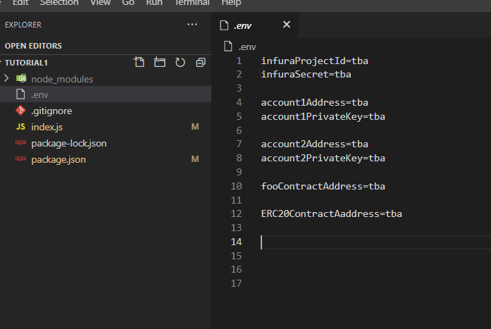
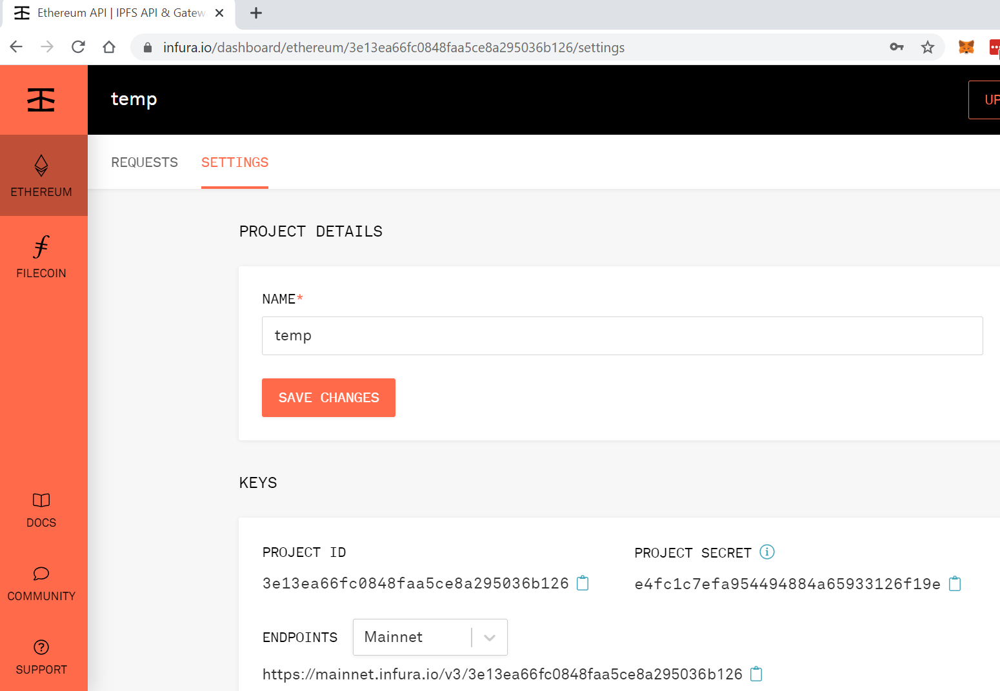
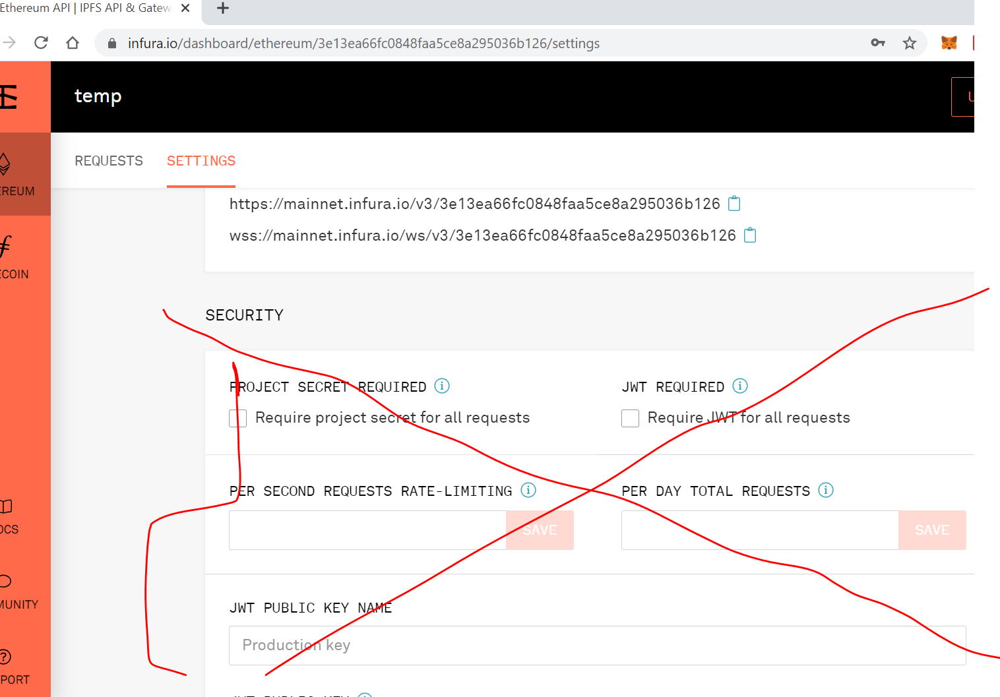
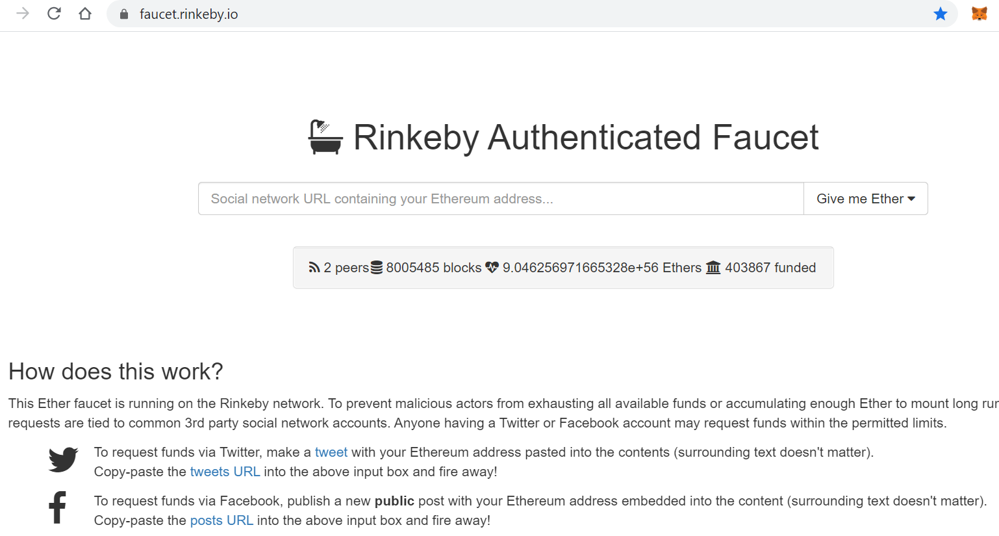

This is an expedited tutorial on ethers.js using a node.js console application.

### Setup

To start off I've set up a minimal node.js application with index.js as the entry point. 
I've installed two packages: 
* npm install ethers
* npm install dotenv



I also created a .env file and as a starting point have added in some variables to be populated




Before you start you'll need an Infura Project ID and secret. So sign up and create a new project.



Make sure you keep this information secret. I created this project for demo purposes and I'll delete it before posting this tutorial

Don't touch any settings below. Just creating the project should be all you need to do.



Add the ProjectID and Secret to the dotenv file.


### Generate Random Accounts

First thing I'll demonstrate is using the console app to generate a random ethereum blockchain address:

 ```javascript
require('dotenv').config();
const ethers = require('ethers');
const randomAccount = ethers.Wallet.createRandom();
console.log(randomAccount);
```

Run the script ('npm start' in console terminal window)

Get the address and privateKey from the generated account and add them to the .env file (account1).

Run the script again and add to the .env file (account2)


### ETH Faucet

Add some Ether to account1:

Go to [faucet.rinkeby.io](https://faucet.rinkeby.io/) and follow the instructions to add ether.



Confirm your account has ether in it by going to [rinkeby.etherscan.io](https://rinkeby.etherscan.io)


### Get Account Balance

To get the ETH balance of the account I'll need to connect to the blockchain via Infura.

Replace the contents of index.js with the following

 ```javascript
require('dotenv').config();
const ethers = require('ethers');
const {address, projectId, projectSecret } = process.env;

// const provider = new ethers.providers.InfuraProvider('rinkeby', projectId);
const provider = new ethers.providers.InfuraProvider('rinkeby', {projectId, projectSecret});

 //IIFE to handle async/await
 (async function () {
  const balanceRaw = await provider.getBalance(address);
  console.log(balanceRaw);
  const balanceInWei = parseInt(balanceRaw._hex);
  console.log(balanceInWei);
	const ethBalanceRaw = balanceInWei * 0.000000000000000001;
	const ethBalanceFinal = Math.round(ethBalanceRaw * 100) / 100;
	console.log(ethBalanceFinal);
})();
 ```

The provider is my Infura connection to the rinkeby testnet using my infuraProjectId.

Also for ease of reference I have the address of the account that I want to query from the .env file.

The IIFE runs the the 'getBalance' function and parses the result.

I think there may be an ethers.utils function that can simplify this but I've just done it the long way.

After running this, it should return the balance for account1.


### Contracts

Go to [Remix](https://remix.ethereum.org/) and create a simple contract using [Solidity](https://en.wikipedia.org/wiki/Solidity).

I'm going to demo two contracts at the same time. 

I have a demo from Solidity [docs](https://docs.soliditylang.org/en/v0.8.0/introduction-to-smart-contracts.html#simple-smart-contract)


```solidity
// SPDX-License-Identifier: GPL-3.0
pragma solidity >=0.4.16 <0.9.0;

contract SimpleStorage {
    uint storedData;

    function set(uint x) public {
        storedData = x;
    }

    function get() public view returns (uint) {
        return storedData;
    }
}
```

And also an ERC20 simple contract [docs](https://docs.soliditylang.org/en/v0.8.0/introduction-to-smart-contracts.html#simple-smart-contract)

```solidity
pragma solidity ^0.6.0;

import "https://github.com/OpenZeppelin/openzeppelin-contracts/blob/v3.3.0/contracts/token/ERC20/ERC20.sol";

// Example class - a mock class using delivering from ERC20
contract BasicToken is ERC20 {
  constructor(uint256 initialBalance) ERC20("Basic", "BSC") public {
    _mint(msg.sender, initialBalance);
    _setupDecimals(0);
  }

}
```

### Compile & Deploy in Remix

To get these contracts onto the Ethereum Rinkeby network via Remix:

Add [Metamask](https://metamask.io/) browser plugin and add the newly created accounts.

Compile in [Remix](http://remix.ethereum.org) and deploy using 'Injected Web3' environment.


### Compile & Deploy using Ethers & Waffle

Install Waffle and compile the contracts using the instructions on their [getting started](https://ethereum-waffle.readthedocs.io/en/latest/getting-started.html) page:

* [Installation](https://ethereum-waffle.readthedocs.io/en/latest/getting-started.html#installation)
* [External Dependency](https://ethereum-waffle.readthedocs.io/en/latest/getting-started.html#add-external-dependency)
* [Compiling the Contract](https://ethereum-waffle.readthedocs.io/en/latest/getting-started.html#compiling-the-contract)


The build folder should now contain JSON files that contain amongst other things the ABI and bytecode.

Deploy the simpleStorage contract using the following code:

 ```javascript
require('dotenv').config();
const ethers = require('ethers');
const {abi,bytecode} = require('./build/simplestorage.json');

const {account1Address, privateKey, projectId, projectSecret } = process.env;
const provider = new ethers.providers.InfuraProvider('rinkeby', {projectId, projectSecret});
const wallet = new ethers.Wallet(privateKey, provider);
const factory = new ethers.ContractFactory(abi, bytecode, wallet);

//IIFE to handle async/await
(async function () {
 // let args = deploy.inputs.map(x => x.value);
 // let tx = await factory.deploy(...args);
 let tx = await factory.deploy();
  await tx.deployed();
  console.log(tx);
})();
```

Repeat this process for the ERC20 Basic Token.

 ```javascript
require('dotenv').config();
const ethers = require('ethers');
const {abi,bytecode} = require('./build/BasicToken.json');
const {account1Address, privateKey, projectId, projectSecret } = process.env;

const provider = new ethers.providers.InfuraProvider('rinkeby', {projectId, projectSecret});
const wallet = new ethers.Wallet(privateKey, provider);
const factory = new ethers.ContractFactory(abi, bytecode, wallet);

//IIFE to handle async/await
(async function () {
 // let args = deploy.inputs.map(x => x.value);
 // let tx = await factory.deploy(...args);

 let constructorArgs = [1000];
 let tx = await factory.deploy(constructorArgs);
  await tx.deployed();
  console.log(tx);
})();
```


